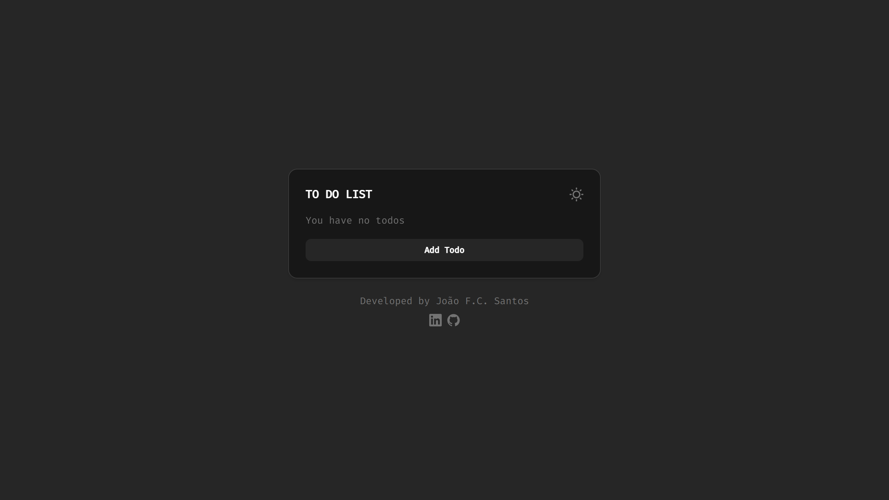

## TO DO LIST

### What frameworks and languages were used?

-   Vite
-   React
-   Typescript
-   Tailwind CSS

## Veja o projeto a funcionar [aqui.](https://to-do-list-sanntozzz.vercel.app/)



## Como executar

```
1. Abrir um terminal na pasta do projecto.

2. Executar o comando "yarn".

3. Executar o comando "yarn dev".

4. Abrir um navegador e ir ao localhost:5173.
```
